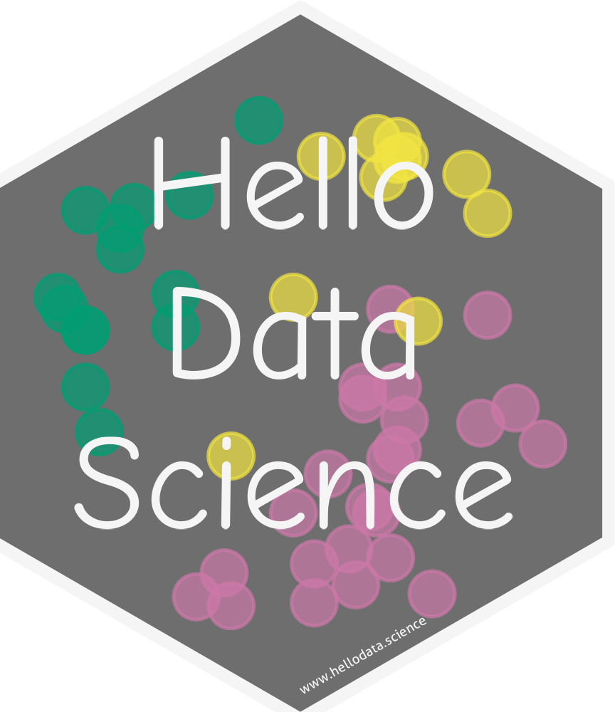
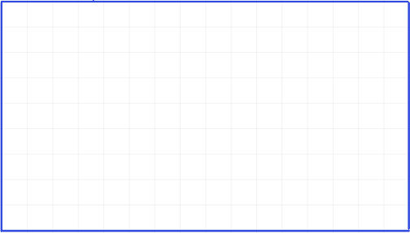
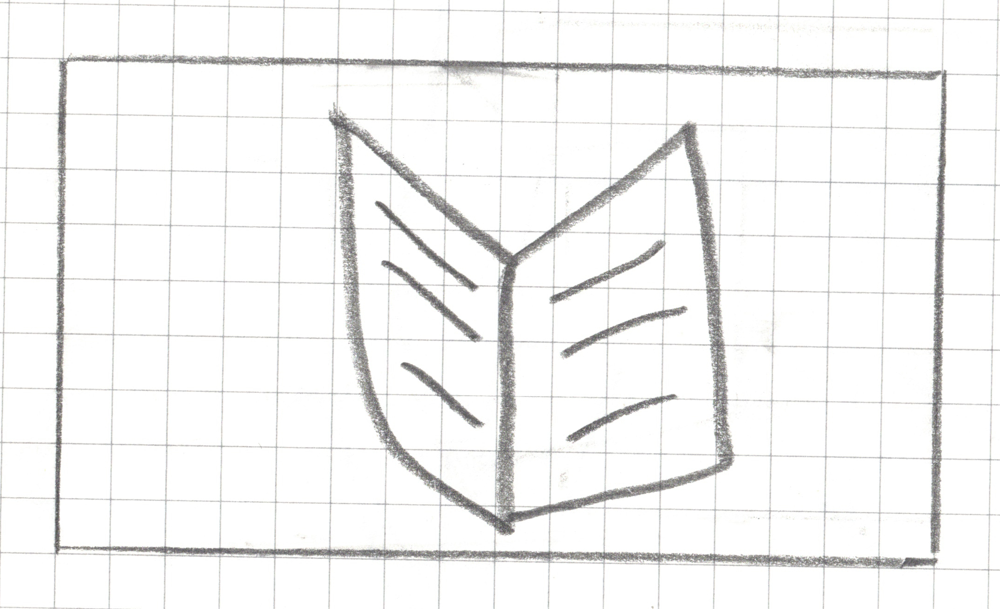
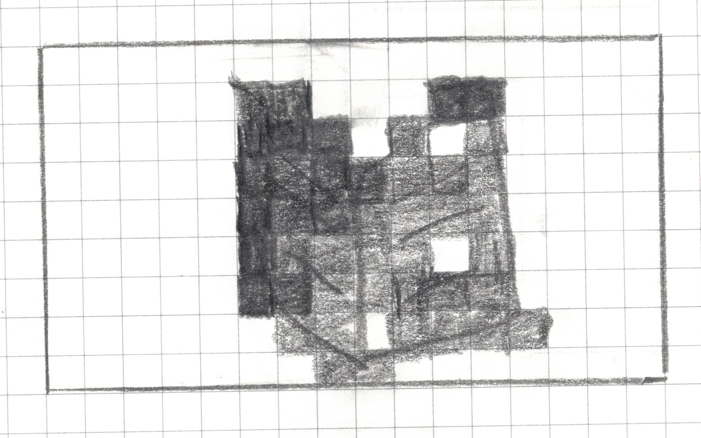
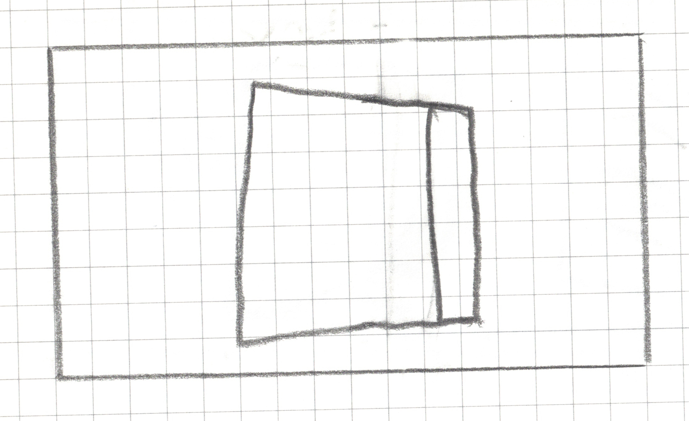
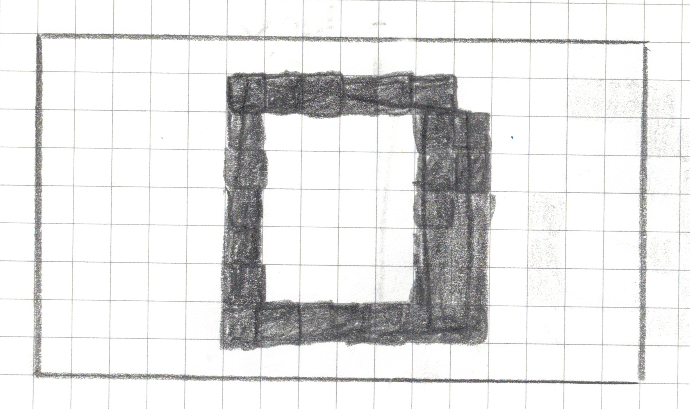
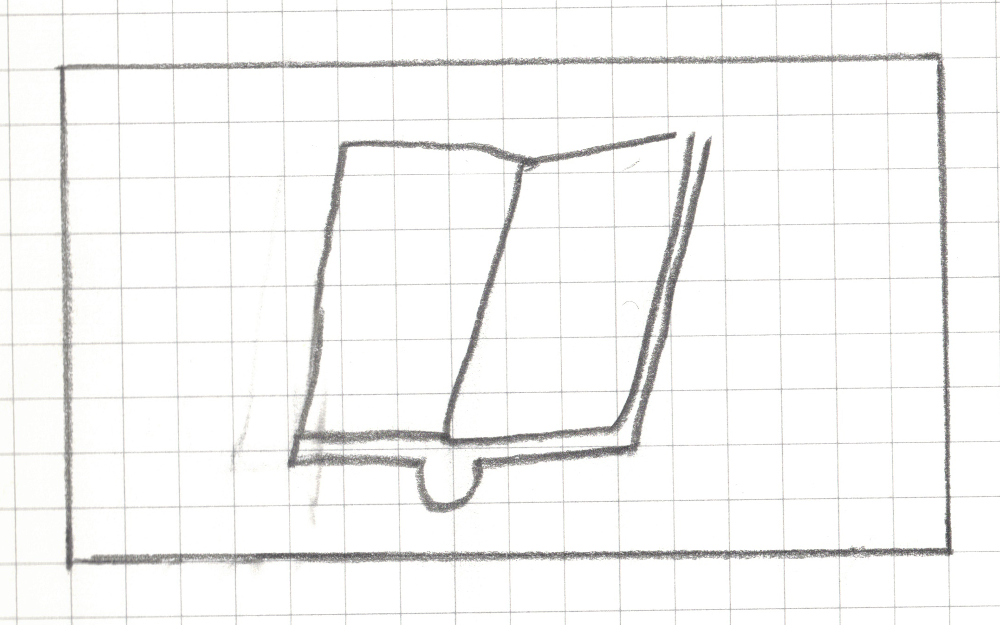
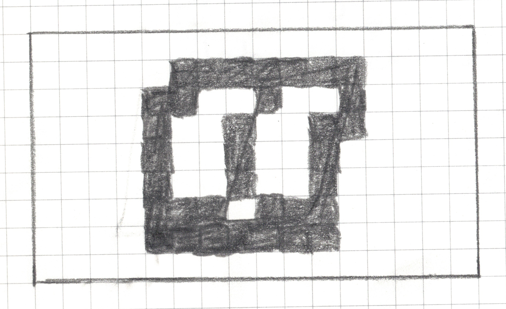
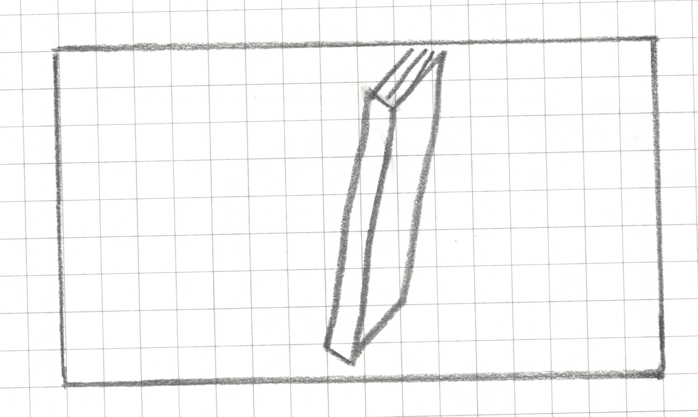
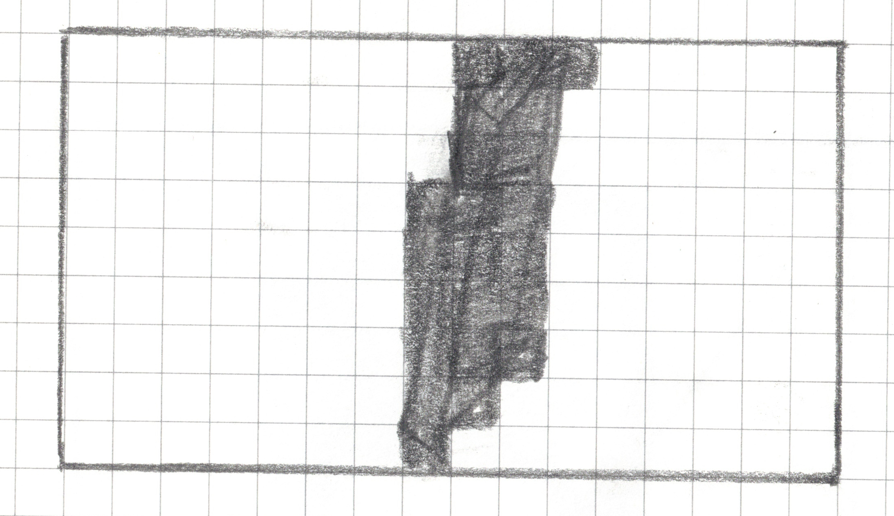

## Introductions (our team)

::: {.panel-tabset}

### Catalina Medina

:::: {.columns}

::: {.column width="40%"}

{fig-alt="Headshot of a smiling woman with long brown hair."}

:::

::: {.column width="60%"}

- California State University Channel Islands
- 1 year of experience teaching IDS, plus TA experience!
- Maximum of 25 students in each IDS class
- Most students take IDS for to satisfy GE, some are DS majors

:::

::::


### Alma Castro

:::: {.columns}

::: {.column width="40%"}

{fig-alt="Headshot of a smiling woman with long brown hair."}

:::

::: {.column width="60%"}

- Cypress (Community) College 
- 4 years of experience teaching IDS

:::

::::

### Mine Doğucu

:::: {.columns}

::: {.column width="40%"}

{fig-alt="Headshot of a smiling woman with short brown hair."}

:::

::: {.column width="60%"}

- University of California, Irvine
- 5+ years of experience teaching IDS

:::

::::

:::

## Introductions (you!)

Let's do a Zoom waterfall chat! Type in the chat:

- Institution type, and
- years of experience teaching IDS (Introductory Data Science)

Don't hit send yet! We'll let everyone know when to send together.


## Breakout Session

The flow of this session will cover:

1. Content
2. Tools
3. Examples

The **purpose** of this session is to share:

- Curriculum
- Open access materials (e.g., online textbook, real data sets, and teaching activity!)
- Experiences

# Content

## Curriculum

We will start by sharing the topics we cover in our IDS, highlighting **similarities** and **differences**


## Dogucu's topics

::: {.panel-tabset}

### Coding focused unit

- W1: Intro to R, Quarto, and GitHub &Describing data with numbers
- W2: Data visualization
- W3 & W4: Data wrangling & Good workflow practices
- W5: Webscraping & Midterm

### Modeling and inference unit

- W6: Into to statistical inference & Beta-Binomial model
- W7: Bayesian inference
- W8: Frequentist inference
- W9: SLR
- W10: Multiple LR and Logistic Regression

:::

## Medina's topics

::: {.panel-tabset}

### Coding focused unit

- W1: Intro to R, Quarto, and GitHub
- W2: Data frames, variables, and summary stats
- W3: Data visualization
- W4 & W5: Data wrangling
- W6: EDA project 

*Project provides a nice pause!*

### Machine learning unit

- W7: Intro machine learning with SLR for prediction
- W8: Multiple LR and model selection
- W9: Logistic regression
- W10: Clustering

*I've found this to be the unit students do best in!*

### Statistical inference unit

- W11: Midterm & Into to statistical inference
- W12: Sampling distribution
- W13: Bootstrap confidence intervals
- W14: *Work on final team project*
- W15: Intro to probability distributions for modeling

:::

## Catros's topics

::: {.panel-tabset}

### Unit 1

- W1: 
- W2: 
- W3: 
- W4:
- W5: 
- W6: 
- W7: 
- W8: 
- W9: 
- W10: 
- W11: 
- W12: 
- W13: 
- W14: 
- W15: 

:::

## Summary

Even if your course differs in topics or tools, you can still benefit from individual parts of this session!

The three of us differ by topics, but all three of us teach IDS using

- R, especially tidyverse
- data-centered explorations
- open access materials

. . .

**We are developing an open-access textbook for IDS!**


## Open access textbook for IDS

- [Hello Data Science Textbook](https://hellodata.science/)

{fig-alt="Hello Data Science logo of dots colored into three clusters."}

## Released chapters

<!-- Add titles for 10 chapters -->

. . .

- Still to come: Modeling and inference


## Highlights

- Real data sets from variety of contexts
- cultural data science (lubridate example)
- accessibility considerations and improvements
- diagrams to explain ds concepts
- example EDA project (ch 9 & 10)
- reproducible practices with Quarto, GitHub, style guide, ...

# Tools

# Examples

# Classroom Activity

Inspired by USCOTS 2025 workshop by Anna Fergusson

From sketchy intuitions to imperfect rules: Using digital image data from drawings to introduce informal classification models

## Step 0: Get into teams of 4 - 5

## Step 1: Familiarize yourself with your landscape drawing area, 16 squares by 9 squares

::: {style="text-align: center;"}

```{r}
#| fig-align: center
#| echo: false
#| out-width: 60%
#| fig-alt: "A blank rectangular grid with a blue border and a white background overlaid with a uniform light blue grid of evenly spaced rows and columns, containing no data, labels, or axes, suggesting an empty chart or graph template awaiting content."

```

:::

## Step 2: Draw _______ within your drawing area in less than 15 seconds without showing it to your teammates.

. . . 


## Step 2: Draw a book within your drawing area in less than 15 seconds without showing it to your neighbors.

```{r}
#| echo: false
countdown::countdown(minutes = 0, seconds = 15)
```


## Step 2.5: Now you can take a look at each others' drawings.

. . .

An example: 

```{r}
#| fig-align: center
#| echo: false
#| out-width: 60%
#| fig-alt: "A hand-drawn pencil sketch on graph paper, enclosed in a rectangular border, showing a simple open book icon drawn in pencil — two symmetrical curved pages spread open at a central spine, with diagonal lines on each page representing text"

```


## Step 3: Pixelate your drawing

For any square that has a line, a dot or any pen/pencil mark, shade the whole square.

::: {style="text-align: center;"}

```{r}
#| fig-align: center
#| out-width: 60%
#| echo: false
#| fig-alt: A pixel art design drawn in pencil on a 16x9 graph paper grid. Columns and rows are not labeled but for the purposes of this alt text assume that the columns are labeled a-p, rows 1-9. The irregular shape consists of various shades of gray pencil markings, with some internal white (unshaded) cells. Shaded cells include f2, g2, k2, l2, f3, g3, h3, j3, l3, f4, g4, h4, i4, j4, k4, l4, f5, g5, h5, i5, j5, k5, l5, f6, g6, h6, i6, j6, l6, f7, g7, h7, i7, j7, k7, l7, g8, h8, j8, k8, l8, m8, h9, i9.

```

:::

## Step 4: Write your algorithm

Use your drawing as well as the drawings of your teammates (only your teammates) to come up with an algorithm (a set of rules) that can identify an open book. In other words, the algorithm should should identify whether the drawn book is open or closed.


## MY CLASSIFICATION ALGORITHM  


 
Algorithm Name: _______________________

My Rule (write it step-by-step):  
1. ____________________________________________________  
2. ____________________________________________________  
3. ____________________________________________________  
4. Classification Decision:  
   `if` _________________ `then` predict "open".  
   `else` predict "closed". 


## The Vertical Gap Scanner

1. Go through the image one row at a time, from top to bottom.

2. For each row, check if it qualifies as a "Gapped Row." A row is a "Gapped Row" if it meets both of these conditions:
- It has at least one filled-in square.
- It has 3 empty squares between its leftmost filled square and its rightmost filled square.


## The Vertical Gap Scanner

3. Count the number of gapped rows and save it as `gap_row_count`.

4. Classification Decision:  
  `if` `gap_row_count` >= 1 `then` predict "open".  
   `else` predict "closed". 

## Step 5: Test your model

| image_id | actual_class | predicted_class |
|----------|--------|-----------|
| 1        |        |           |
| 2        |        |           |
| .        |        |           |
| .        |        |           |
| .        |        |           |
| 9        |        |           |
| 10       |        |           |

## Image Example 1

::: {style="text-align: center;"}

```{r}
#| fig-align: center
#| out-width: 60%
#| echo: false
#| fig-alt: closed book image with only edges and spine drawn from the back cover view

```

:::

`actual_class` = closed


## Image Example 1

::: {style="text-align: center;"}

```{r}
#| fig-align: center
#| out-width: 60%
#| echo: false
#| fig-alt: A pixel art design drawn in pencil on a 16x9 graph paper grid. Columns and rows are not labeled but for the purposes of this alt text assume that the columns are labeled a-p, rows 1-9. The irregular shape consists of various shades of gray pencil markings, with some internal white (unshaded) cells. Shaded cells include f2, g2, h2, i2, j2, k2, f3, k3, l3, f4, k4, l4, f5, k5, l5, f6, k6, l6, f7, k7, l7, f8, g8, h8, i8, j8, k8, l8

```

:::

`predicted_class` = ?


## Image Example 2

::: {style="text-align: center;"}

```{r}
#| fig-align: center
#| out-width: 60%
#| fig-alt: an open book or journal viewed from a three-quarter perspective, tilted slightly to the right. The book is split by a central line for the spine, with both pages completely blank inside. Along the bottom edge of the spine, a small U-shaped loop curves downward.

```

:::

`actual_class` = open

## Image Example 2

::: {style="text-align: center;"}

```{r}
#| fig-align: center
#| out-width: 60%
#| fig-alt: A pixel art design drawn in pencil on a 16x9 graph paper grid. Columns and rows are not labeled but for the purposes of this alt text assume that the columns are labeled a-p, rows 1-9. The irregular shape consists of various shades of gray pencil markings, with some internal white (unshaded) cells. Shaded cells include f2, g2, h2, i2, j2, k2, l2, e3, f3, i3, l3, e4, h4, k4, l4, e5, h5, k5, e6, h6, k6, e7, f7, g7, i7, j7, k7, e8, f8, g8, h8, i8, j8, k8

```

:::

`predicted_class` = ?

## Image Example 3

::: {style="text-align: center;"}

```{r}
#| fig-align: center
#| out-width: 60%
#| fig-alt: The drawing depicts a single closed book standing upright and viewed from a dynamic three-quarter side angle.

```

:::

`actual_class` = closed


## Image Example 3

::: {style="text-align: center;"}

```{r}
#| fig-align: center
#| out-width: 60%
#| fig-alt: A pixel art design drawn in pencil on a 16x9 graph paper grid. Columns and rows are not labeled but for the purposes of this alt text assume that the columns are labeled a-p, rows 1-9. The irregular shape consists of various shades of gray pencil markings, with some internal white (unshaded) cells. Shaded cells include i1, j1, k1, i2, j2, i3, j3, h4, i4, j4, h5, i5, j5, h5, i6, j6, h7, i7, j7, h8, i8, h9

```

:::

`predicted_class` = ?


## More Testing Data


[Quick, Draw](https://quickdraw.withgoogle.com/data/book)


## Model Evaluation

|Criteria | **Predicted: OPEN** | **Predicted: CLOSED** |
| :--- | :--- | :--- |
| **Actual: OPEN** | <span style="color:green; font-weight:bold;">_________</span><br/>**(True Positive)** | <span style="color:orange; font-weight:bold;">________</span><br/>**(False Negative)** |
| **Actual: CLOSED**| <span style="color:red; font-weight:bold;">_______</span><br/>**(False Positive)** | <span style="color:green; font-weight:bold;">________</span><br/>**(True Negative)** |

## Definitions and Discussions

- What is an algorithm? What is a model?

- Are there perfect models? What happens if we have perfect models?

- Training vs. testing


# Questions?

- [Hello Data Science Textbook](https://hellodata.science/)

- [hellodatascience](https://hellodata-science.github.io/hellodatascience) R Package with datasets

- [](https://github.com/hellodata-science/sfemergency25) Additional large dataset not on CRAN

Keep up to date via [Google Form link](https://forms.gle/HxaX3DQQKe3n2BLs8)

{fig-alt="Hello Data Science logo of dots colored into three clusters without pattern."}


